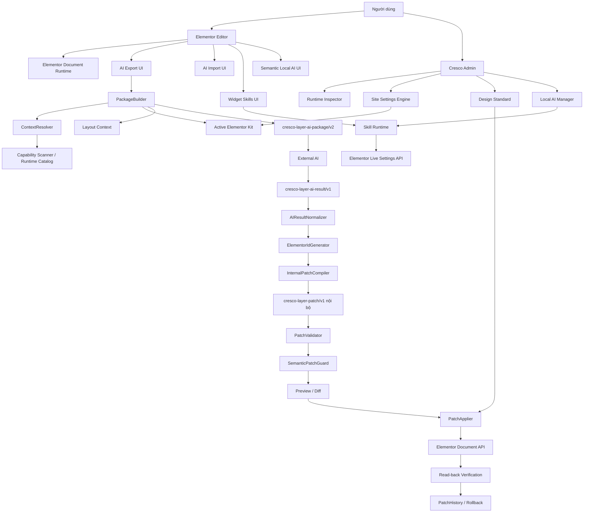
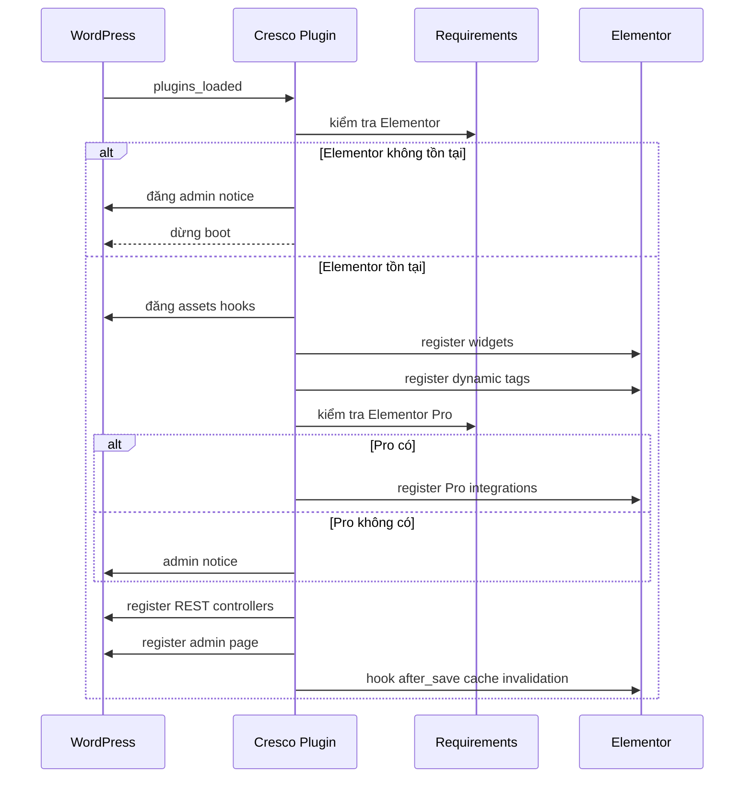
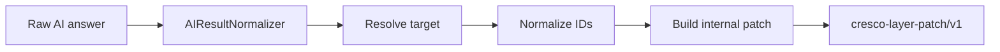
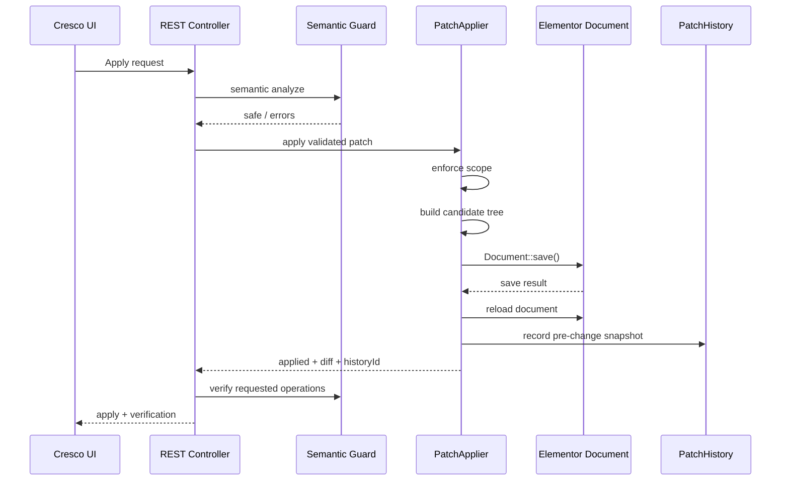
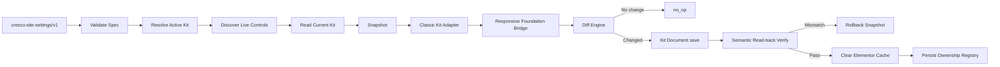
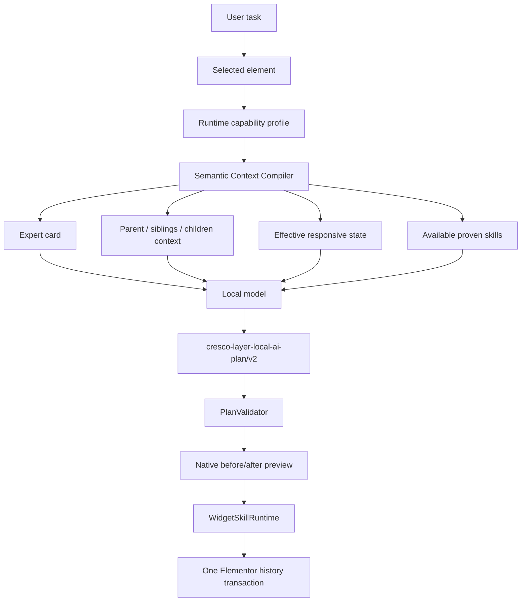
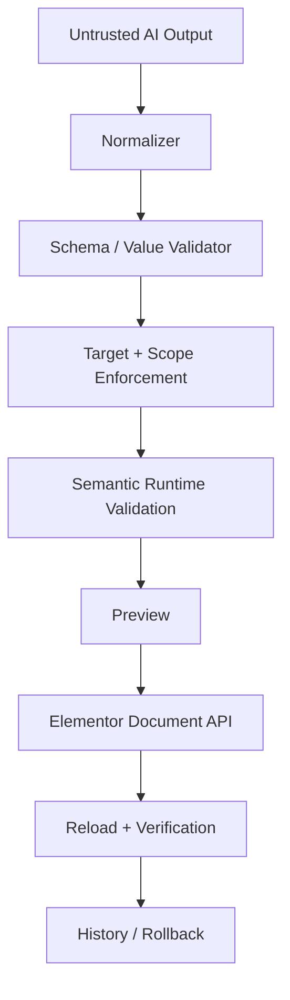

# Báo cáo kiến trúc, chức năng và mô hình kỹ thuật Cresco Layer v0.15.0

> **Phạm vi tài liệu:** mã nguồn trên `main` tại commit `b181d83ac32036c0a8d4fadd446234ba9258d2ee`, trước commit bổ sung chính tài liệu này.  
> **Ngày lập báo cáo:** 2026-08-15.  
> **Đối tượng đọc:** từ người chưa biết WordPress/Elementor cho tới developer cần bảo trì Cresco Layer.  
> **Nguyên tắc đọc:** nếu tài liệu này và mã nguồn hiện tại mâu thuẫn, **mã nguồn trên `main` là source of truth**. Phần “Điểm chưa đồng bộ / Technical debt” ghi rõ các trường hợp tài liệu cũ hoặc UI cũ đã lệch so với backend.

---

## 1. Cresco Layer là gì? — giải thích trong 2 phút

Cresco Layer là một **plugin WordPress chạy cùng Elementor**. Nó không cố thay Elementor bằng một page builder mới. Vai trò chính của nó là tạo một lớp trung gian an toàn giữa:

1. **Elementor** — nơi chứa trang thật, widget thật, Site Settings thật và giao diện người dùng thật;
2. **AI bên ngoài hoặc AI chạy local** — nơi phân tích yêu cầu hoặc tạo thiết kế;
3. **Cresco Layer** — lớp đọc hiểu runtime Elementor, xuất ngữ cảnh cho AI, kiểm tra kết quả AI, preview thay đổi và ghi lại bằng API của Elementor.

Cách hình dung đơn giản nhất:

```text
Elementor = căn nhà thật
AI        = kiến trúc sư đề xuất phương án
Cresco    = kỹ sư giám sát + bộ chuyển đổi bản vẽ + kiểm định an toàn
```

AI không được ghi trực tiếp vào database. AI chỉ mô tả điều nó muốn thay đổi. Cresco kiểm tra xem điều đó có hợp lệ với Elementor đang chạy hay không, sau đó mới dùng chính API của Elementor để áp dụng.

---

## 2. Triết lý cốt lõi của sản phẩm

### 2.1. Elementor luôn là nguồn sự thật

Cresco Layer giữ các nguyên tắc sau:

- document model vẫn là document của Elementor;
- widget/container vẫn là widget/container của Elementor;
- Site Settings vẫn nằm trong Active Elementor Kit;
- responsive vẫn dùng cơ chế của Elementor;
- Update/Publish cuối cùng vẫn do Elementor quản lý;
- Cresco không tạo một “Cresco page model” song song;
- Cresco không dùng `_elementor_data` làm kho riêng để bypass Elementor;
- Cresco không tạo một design-system editor cạnh tranh với Elementor Site Settings.

### 2.2. Runtime thật quan trọng hơn kiến thức hard-code

Elementor thay đổi theo phiên bản, Elementor Pro, addon, Atomic/V4 và plugin bên thứ ba. Vì vậy Cresco cố gắng hỏi trực tiếp runtime đang chạy:

```text
Widget nào đang đăng ký?
Control nào thật sự tồn tại?
Control đó responsive không?
Nó cho phép unit nào?
Option nào hợp lệ?
Range bao nhiêu?
Có condition gì?
Atomic prop binding là gì?
```

Thay vì giả định “Elementor thường có setting X”, Cresco ưu tiên “runtime hiện tại chứng minh setting X tồn tại”.

### 2.3. Native control trước, Custom CSS sau

Mục tiêu của AI workflow là tạo giao diện **Elementor-native**:

```text
Native Elementor control có thể làm được
        ↓
Dùng native control
        ↓
Không có native control phù hợp
        ↓
Mới cân nhắc custom_css
```

Lợi ích:

- người dùng sửa lại được trong Elementor UI;
- responsive đúng cơ chế của Elementor;
- ít CSS khó bảo trì;
- ít phụ thuộc vào selector nội bộ;
- giảm tình trạng AI “vẽ được nhưng Elementor không hiểu”.

### 2.4. Preview trước khi ghi

Cresco phân biệt rõ:

```text
AI đề xuất
→ Validate
→ Semantic Validate
→ Preview / Diff
→ User review
→ Apply
→ Reload & Verify
```

`save()` trả về thành công chưa đủ. Cresco còn đọc lại dữ liệu để kiểm tra giá trị thật sự đã được Elementor giữ lại.

---

## 3. Cresco Layer không phải là gì?

Cresco Layer **không phải**:

- một trình thiết kế thay Elementor;
- một chatbot tự do được phép sửa bất kỳ database field nào;
- một AI code generator chèn HTML/CSS tùy ý rồi bỏ qua Elementor controls;
- một hệ thống publish tự động mọi thay đổi;
- một kho Site Settings riêng;
- một runtime catalog hard-code theo một phiên bản Elementor duy nhất.

Cresco là **integration + validation + intelligence layer**.

---

## 4. Yêu cầu hệ thống và phiên bản hiện tại

Theo `cresco-layer.php` và `composer.json`:

| Thành phần | Yêu cầu / trạng thái |
|---|---|
| Cresco Layer | `0.15.0` |
| WordPress | `6.6+` |
| PHP | `8.1+` |
| Elementor | Bắt buộc |
| Elementor Pro | Không bắt buộc cho core, nhưng cần cho integration Pro |
| Node.js cho development/tests | `>=20` |
| License package | GPL-2.0-or-later |

Nếu Elementor không khả dụng, plugin hiển thị admin notice và không boot phần chức năng chính. Nếu Elementor Pro không có, core vẫn chạy nhưng Pro integrations không được đăng ký.

---

## 5. Bức tranh kiến trúc tổng thể



Điểm cần nhớ: **mọi con đường cuối cùng đều quay về Elementor**. Cresco không sở hữu UI tree cuối cùng của website.

---

## 6. Vòng đời boot của plugin

File trung tâm: `includes/Plugin.php`.

Khi WordPress chạy hook `plugins_loaded`, `CrescoLayer\Plugin::instance()->boot()` được gọi.

### 6.1. Các bước boot



### 6.2. Các service chính được tạo lúc boot

- `Auditor`
- `PackageBuilder`
- `PatchValidator`
- `SemanticPatchGuard`
- `ConfigurationCatalog`
- `RuntimeSnapshotCoordinator`
- `WidgetSkillRuntime`
- Local AI `Settings`, `ProviderManager`, `ContextCompiler`, `PlanValidator`, `Analyzer`, `Manager`
- `PatchApplier`
- REST controllers
- `StandardController`
- `AdminPage`
- Site Settings controller

Đây là kiểu composition root đơn giản: `Plugin.php` lắp các component với nhau và đăng hook; business logic nằm trong class chuyên trách.

---

## 7. Các bề mặt giao diện người dùng

Cresco Layer có hai vùng UI lớn:

1. **Cresco Admin** dưới Elementor trong WordPress Admin;
2. **Cresco tools bên trong Elementor Editor**.

---

## 8. Giao diện Cresco Admin

File PHP chính: `includes/Admin/AdminPage.php`.  
JavaScript chính: `assets/admin.js`.  
CSS chính: `assets/admin.css`.

### 8.1. Hero / status

Admin page hiển thị:

- Cresco version;
- Elementor version;
- Elementor Pro version hoặc trạng thái không phát hiện;
- số Elementor document có thể chỉnh;
- dark mode toggle.

### 8.2. Các tab hiện có

| Tab | Quyền | Mục đích |
|---|---|---|
| AI Exchange | `edit_posts` | Export document/context và import thay đổi AI |
| Elementor Site Settings | `manage_options` | Preview/import/verify profile vào Active Kit |
| Design Standard | `manage_options` | Audit/preset/fluid typography cho Kit |
| History | `edit_posts` | Xem patch history và rollback |
| Runtime Inspector | `edit_posts`; full snapshot admin-only | Xem runtime widgets/elements/controls |
| Local AI | `manage_options` | Cấu hình provider/model Local AI |

### 8.3. AI Exchange trên Admin hiện tại

Admin UI hiện vẫn có cấu trúc legacy tương đối kỹ thuật:

- chọn Elementor document;
- chọn context profile `Smart` hoặc `Full`;
- `Export for AI`;
- `Run audit`;
- `Copy package`;
- `Copy AI instructions`;
- drop `.json` patch;
- textarea đang ghi rõ `cresco-layer-patch/v1`;
- `Validate & Preview`;
- `Apply reviewed patch`.

**Lưu ý quan trọng:** backend v0.15.0 đã có AI result workflow đơn giản hơn, nhưng admin UI này chưa được đổi hoàn toàn sang `cresco-layer-ai-result/v1`. Đây là một technical debt được phân tích ở phần cuối.

### 8.4. Review panel

`assets/admin.js` render:

- Patch preview;
- inserted/removed/moved/updated counts;
- effective/no-op operation counts;
- semantic warnings;
- before/after values từng setting;
- audit comparison;
- audit scores Accessibility / Performance / Design Consistency.

---

## 9. Giao diện bên trong Elementor Editor

Các asset được load theo dependency chain:

```text
clipboard-guard.js
      ↓
editor.js
      ↓
exact-runtime-export.js
      ↓
skills.js
      ↓
skills-accuracy.js
      ↓
semantic-ai.js
```

CSS tương ứng:

- `frontend.css`
- `editor.css`
- `skills.css`
- `semantic-ai.css`

### 9.1. Editor bridge

`assets/editor.js` chịu trách nhiệm:

- theo dõi element đang selected;
- đọc ID từ Elementor channel/model/DOM fallback;
- context menu integration;
- export modal;
- selection collection;
- import modal;
- preview/apply request;
- live editor application;
- Elementor history transaction;
- reload khi structural replacement không thể phản ánh an toàn chỉ bằng live settings.

### 9.2. Export modal hiện tại

“Edit with AI” cho phép:

- **This element only**;
- **This section + children**;
- **Selected elements**;
- Copy instructions;
- Copy package;
- Download file.

`exact-runtime-export.js` còn chèn thêm lựa chọn runtime profile:

- Exact Runtime;
- Smart.

Mặc định JavaScript của Exact Runtime là `exact`, trừ khi local storage đã lưu `smart`.

### 9.3. Import modal hiện tại và điểm lệch với backend

Editor modal hiện có:

- drag/drop JSON;
- choose JSON file;
- paste clipboard;
- manual textarea fallback;
- target detection;
- Validate & Preview;
- Apply.

Tuy nhiên ở mã `assets/editor.js` hiện tại, `detectPayload()` chỉ coi payload top-level là import hợp lệ khi:

```json
{
  "schema": "cresco-layer-patch/v1"
}
```

UI cũng còn ghi:

```text
Expected: cresco-layer-patch/v1
```

Trong khi backend v0.15.0 đã hỗ trợ `cresco-layer-ai-result/v1`, markdown fences, wrappers và prose. Đây là lý do có thể xảy ra tình huống:

```text
Backend: hiểu AI result mới
Frontend: chặn từ trước khi gửi request
```

Nói cách khác, **architecture backend đã đi trước UI integration**.

---

## 10. Workflow External AI — mục tiêu và trạng thái hiện tại

Mô hình sản phẩm mong muốn:

```text
Select Elementor element
→ Export for AI
→ Gửi JSON + hình tham chiếu cho AI
→ AI trả Elementor tree
→ Import AI Result
→ Cresco tự compile patch
→ Preview
→ Apply
```

### 10.1. Export schema hiện tại

Server hiện export:

```text
cresco-layer-ai-package/v2
```

chứ chưa đổi transport chính thành một `cresco-layer-ai-input/v1` hoàn toàn mới.

`PackageBuilder` tạo package có thể chứa:

- manifest;
- editable scope;
- current Elementor data;
- parent/sibling context;
- element states;
- design system / Active Kit data;
- widget/element catalog;
- registry index;
- Dynamic Tags;
- runtime coverage;
- layout context;
- assets/templates;
- AI instructions.

### 10.2. Vì sao package cần runtime controls?

Elementor thường không lưu setting nếu widget đang dùng default. Ví dụ một Heading có thể hỗ trợ `title_color` nhưng raw settings không có key đó vì đang dùng default.

Nếu chỉ gửi raw element:

```text
AI nhìn thấy key đang có
≠
AI biết toàn bộ control widget có thể dùng
```

Runtime catalog bổ sung phần kiến thức còn thiếu đó.

---

## 11. Context Resolver: giảm nhiễu cho AI

Component chính: `includes/AI/ContextResolver.php`.

Có hai profile server-side lịch sử/chính:

### Smart

Chỉ mở rộng chi tiết các capability liên quan đến:

- element trong editable scope;
- parent/sibling context;
- common insertion candidates;
- global design context cần thiết.

Toàn bộ registered types vẫn có thể xuất hiện dưới dạng compact registry index.

### Full

Mở rộng detailed controls cho tất cả registered widget/element types.

### Tại sao không gửi Full Runtime Snapshot mọi lần?

Một site có thể có hàng trăm widget và hàng nghìn controls. Gửi toàn bộ mỗi lần:

- tốn token;
- làm model khó tìm đúng thông tin;
- tăng khả năng dùng nhầm control không liên quan.

Context Resolver biến runtime lớn thành context gọn theo nhiệm vụ.

---

## 12. Exact Runtime Export

File: `assets/exact-runtime-export.js`.

Đây là lớp browser-side enrichment đặt trên package v2.

### 12.1. Cơ chế

Script intercept request export của Cresco:

```text
editor requests /documents/{id}/export
        ↓
server trả package v2
        ↓
Exact Runtime script xác định widget/element types cần thiết
        ↓
GET từng /elementor-catalog/widget/{name}
GET từng /elementor-catalog/element/{name}
        ↓
chỉ chấp nhận entry detailLoaded=true
        ↓
nhúng runtimeCapabilities + capabilityLock + siteDesignContext
        ↓
trả response enriched cho editor
```

### 12.2. Fail closed

Nếu detail cần thiết không tải được:

```text
Incomplete Exact Runtime capability
→ export trả lỗi
```

Nó không âm thầm để AI đoán.

### 12.3. Capability Lock

Package enriched ghi rõ các nguyên tắc:

- không invent control key;
- không invent responsive suffix;
- validate control shape;
- validate unit/option/range/condition;
- Custom CSS chỉ khi native control không biểu đạt được;
- reuse Active Kit/design system;
- chỉ dùng widget/element type có trong runtime capabilities.

### 12.4. Construction set

Exact Runtime chủ động quan tâm tới nhóm widget/element thường cần khi dựng giao diện, ví dụ:

- heading;
- text-editor;
- button;
- image;
- icon;
- icon-list;
- divider;
- spacer;
- form;
- Cresco widgets;
- một số Atomic elements;
- container/section/column/flex/grid.

Chỉ những type thực sự registered mới được đưa vào set cuối.

---

## 13. AI Result v1 — bước đơn giản hóa quan trọng của 0.15.0

Backend mới cho phép AI **không cần viết patch mechanics**.

AI có thể trả tối thiểu:

```json
{
  "schema": "cresco-layer-ai-result/v1",
  "target": {
    "postId": 3,
    "id": "3ed4781"
  },
  "element": {
    "id": "3ed4781",
    "elType": "container",
    "settings": {},
    "elements": [
      {
        "elType": "widget",
        "widgetType": "heading",
        "settings": {
          "title": "HELLO"
        },
        "elements": []
      }
    ]
  }
}
```

AI không cần biết:

- checksum;
- scope object;
- `replace-element`;
- `insert-element`;
- child Elementor IDs;
- PatchApplier;
- autosave implementation;
- history implementation.

Đây là separation rất quan trọng:

```text
External contract = mô tả giao diện
Internal contract = mô tả thao tác kỹ thuật
```

---

## 14. AIResultNormalizer — làm importer tolerant với output thật của chat model

File: `includes/AI/AIResultNormalizer.php`.

AI thường không trả đúng một object JSON trần. Nó có thể trả:

````text
Dưới đây là kết quả:

```json
{ ... }
```
````

hoặc:

```json
{
  "result": {
    "schema": "cresco-layer-ai-result/v1",
    "element": {}
  }
}
```

Normalizer xử lý các tình huống này.

### 14.1. Những dạng được hiểu

- direct AI result;
- markdown fenced JSON;
- prose trước/sau JSON;
- wrapper `result`;
- `data`;
- `output`;
- `response`;
- `payload`;
- `aiResult` / `ai_result`;
- `json`;
- nested wrappers tối đa 6 tầng;
- legacy `{ "patch": ... }`;
- legacy `cresco-layer-patch/v1`;
- thiếu schema nhưng shape rõ ràng có `element.elType` hoặc `element.widgetType`.

### 14.2. Tolerance không có nghĩa là nhận mọi JSON

Nếu JSON không nhận diện được, Cresco từ chối và trả diagnostic gồm:

- schema nếu có;
- top-level keys;
- schema mong đợi.

Mục đích là giảm việc người dùng phải “sửa JSON bằng tay” nhưng vẫn không nhận payload tùy tiện.

---

## 15. ElementorIdGenerator — ID con là việc của Cresco

Khi AI tạo widget mới, AI có thể không biết ID nào đã tồn tại ở phần khác của document.

Vì vậy root target ID được giữ, còn child ID được normalize.

Policy:

```text
Root ID = ID của target thật → không đổi
Child có ID hợp lệ + unique + không collide → có thể giữ
Child thiếu ID → Cresco sinh
Child ID sai format → Cresco sinh lại
Child ID collide document → Cresco sinh lại
Hai child trùng ID → Cresco deduplicate
```

ID được sinh theo shape 7 ký tự hex giống kiểu Elementor thường dùng.

Điều này giúp AI tập trung vào giao diện chứ không làm nhiệm vụ database identity.

---

## 16. InternalPatchCompiler — biến “giao diện AI muốn” thành thao tác nội bộ

File: `includes/AI/InternalPatchCompiler.php`.

### 16.1. Input

- raw AI answer;
- post ID đang mở;
- current document elements;
- selected Elementor element ID nếu editor biết.

### 16.2. Quy trình



### 16.3. Target safety

Compiler từ chối khi:

- result ghi post ID khác document đang mở;
- result target khác element đang selected;
- `target.id` và returned root ID bất nhất;
- target đã bị xóa;
- không có target và editor cũng không có selection.

Không có hành vi “thấy target sai nhưng tự áp sang selection hiện tại”.

### 16.4. Patch nội bộ được sinh

AI result subtree thường compile thành:

```json
{
  "schema": "cresco-layer-patch/v1",
  "base": { "postId": 3 },
  "scope": {
    "mode": "subtree",
    "rootElementId": "3ed4781",
    "elementIds": ["3ed4781"]
  },
  "operations": [
    {
      "operation": "replace-element",
      "elementId": "3ed4781",
      "element": {}
    }
  ]
}
```

Người dùng và AI không cần viết block này.

---

## 17. Internal patch model

Schema:

```text
cresco-layer-patch/v1
```

Các operation hiện hỗ trợ:

| Operation | Ý nghĩa |
|---|---|
| `update-setting` | đổi một Elementor setting |
| `remove-setting` | xóa một setting |
| `replace-settings` | thay toàn bộ settings của một element |
| `replace-element` | thay object element/subtree |
| `insert-element` | chèn element mới |
| `remove-element` | xóa element |
| `move-element` | đổi parent/vị trí |
| `update-page-setting` | đổi page setting |
| `remove-page-setting` | xóa page setting |
| `replace-document` | thay toàn bộ document |

Patch schema vẫn hữu ích vì:

- deterministic;
- diff được;
- audit được;
- verify được;
- scope enforcement rõ;
- backward compatibility với AI results cũ.

Nhưng từ 0.15.0, đây nên được hiểu là **internal/advanced transport**, không phải format AI bắt buộc phải tự xây.

---

## 18. Checksum: đã rời khỏi external AI freshness contract

AI workflow hiện **không cần checksum** để import.

`PatchValidator` chỉ giữ `base.postId` trong normalized patch. Checksum bên ngoài không phải freshness gate.

Tuy vậy Cresco vẫn tính internal checksum để:

- ghi audit/history metadata;
- so sánh rollback integrity;
- diagnostic sau save.

Khác biệt:

```text
Trước đây:
checksum mismatch → block AI patch

Hiện tại:
checksum không phải điều kiện AI import
nhưng hash nội bộ vẫn có ích cho history/verification
```

---

## 19. PatchValidator — validation cấu trúc và dữ liệu nguy hiểm

`PatchValidator` là lớp schema/safety đầu tiên sau normalization.

Nó chịu trách nhiệm các nhóm kiểm tra như:

- schema đúng;
- post ID hợp lệ;
- scope đúng kiểu;
- element ID đúng format;
- số operation không vượt giới hạn;
- operation thuộc allowlist;
- replacement object đúng cấu trúc cần thiết;
- setting key nhạy cảm bị chặn;
- markup nguy hiểm / JavaScript URL / event handler bị chặn;
- depth/string/value shape có giới hạn.

Validator không quyết định “setting này có thật trong Elementor runtime không”. Việc đó thuộc semantic layer.

---

## 20. SemanticPatchGuard — kiểm tra patch có hợp nghĩa với Elementor thật không

File: `includes/AI/SemanticPatchGuard.php`.

Đây là một trong những lớp quan trọng nhất để tăng độ chính xác.

### 20.1. Hai loại validation khác nhau

```text
PatchValidator:
“JSON này có hợp lệ và an toàn về cấu trúc không?”

SemanticPatchGuard:
“Điều JSON yêu cầu có hợp lệ với Elementor runtime hiện tại không?”
```

### 20.2. Kiểm tra native controls

Guard resolve target widget/element tới live capability catalog và phân loại:

- native control;
- existing unknown persisted setting;
- invalid responsive control;
- unknown setting;
- custom CSS fallback;
- structural operation;
- page setting.

### 20.3. Responsive suffix

Nếu AI dùng:

```text
padding_mobile
```

nhưng control base `padding` không responsive, patch bị block.

### 20.4. Option/unit/range

Khi runtime metadata có đủ thông tin, guard kiểm tra:

- select/choose option;
- slider/numeric range;
- allowed units;
- responsive support;
- value shape.

### 20.5. Unknown persisted setting

Nếu setting đã tồn tại trong document nhưng runtime catalog hiện không mô tả được:

- Cresco không nhất thiết xóa/bẻ nó;
- operation có thể được bảo toàn;
- semantic validation báo warning rằng native metadata validation không khả dụng.

Điều này giúp không phá dữ liệu của addon/future Elementor fields.

### 20.6. Lossless replacement

Khi `replace-settings` hoặc `replace-element`, Cresco kiểm tra để tránh vô tình làm rơi:

- `__globals__` references;
- unknown persisted settings;
- existing Elementor fields.

### 20.7. Custom CSS analysis

Guard có mapping từ CSS property sang native control hints, ví dụ:

```text
padding          → padding
margin           → margin
min-height       → min_height
background-color → background / background_color
border-radius    → border_radius
font-size        → typography / font_size
```

Mục tiêu là phát hiện khi AI dùng CSS trong khi native control có thể phù hợp.

Guard cũng phát hiện một số synthetic CSS variable kiểu:

```css
--padding-top: 40px;
```

nhưng không bao giờ được consume bằng `var(...)`, vì đó là visual no-op.

> Lưu ý: “native first” được enforce một phần qua semantic warning/error logic. Không nên diễn giải rằng mọi Custom CSS trùng native property đều luôn bị hard-reject trong mọi trường hợp.

---

## 21. Preview / Diff model

Preview không ghi document.

`PatchApplier::preview()`:

1. validate patch;
2. load working Elementor document;
3. enforce expected scope;
4. enforce operation boundaries;
5. clone elements/settings trong memory;
6. apply operations lên candidate copy;
7. tạo diff;
8. audit before/after;
9. trả thông tin về việc save sau đó có dùng autosave hay không.

`Diff` render được before/after từng operation và dùng `SerializableSanitizer` để tránh leak secret-like values ra UI.

Có giới hạn số detail và độ dài value để preview không trở thành payload khổng lồ.

---

## 22. Apply: Cresco ghi vào Elementor như thế nào?

File: `includes/AI/PatchApplier.php`.

### 22.1. Không ghi `_elementor_data` trực tiếp

Architecture invariant cấm code pattern ghi trực tiếp Elementor document data qua `update_post_meta(..., '_elementor_data', ...)`.

PatchApplier dùng:

```text
Elementor Document API
→ $document->save(...)
```

### 22.2. Working document / autosave

Cresco lấy:

```text
get_doc_or_auto_save(postId, currentUser)
```

Nếu post đã publish/private và chưa có working autosave, Cresco ưu tiên autosave để người dùng review trước thay vì tự publish live document.

### 22.3. Apply sequence



### 22.4. Post-apply verification

REST controller gọi `SemanticPatchGuard::verify()` sau apply.

Verification đọc working data đã save và kiểm tra từng operation, ví dụ:

- update-setting có đúng value;
- removed setting thực sự biến mất;
- replaced element fields có persist;
- inserted element có tồn tại;
- moved element đúng parent/index;
- page setting đúng;
- document replacement có đúng ID tree.

Điều này phân biệt:

```text
Save API không báo lỗi
≠
Mọi giá trị AI yêu cầu đều đã persist đúng
```

---

## 23. Scope safety

Elementor page có thể rất lớn. AI chỉ nên sửa vùng được giao.

Các scope lịch sử/current internal:

- `document`;
- `widget`;
- `subtree`;
- `selection`.

PatchApplier kiểm tra:

- scoped target có còn tồn tại;
- operation elementId có nằm trong allowed IDs;
- scoped patch không được update page setting;
- widget-only không được insert/move children;
- insert/move phải có parent trong allowed scope;
- replacement subtree mới được bổ sung vào allowed map khi hợp lệ.

Editor còn có `expectedScope` để buộc patch root khớp element người dùng đang chọn.

---

## 24. History và Rollback

File: `includes/AI/PatchHistory.php`.

Schema:

```text
cresco-layer-patch-history/v1
```

Post meta:

```text
_cresco_layer_patch_history
```

### 24.1. Snapshot trước thay đổi

Mỗi apply lưu snapshot **trước patch** nếu kích thước cho phép.

Metadata gồm:

- ID;
- label;
- kind: patch/rollback;
- số operations;
- scope;
- storage target;
- internal base/saved checksums;
- user;
- timestamp;
- snapshot size;
- restorable flag.

### 24.2. Giới hạn lưu trữ

- tối đa 20 entries;
- tối đa 2 MB mỗi snapshot;
- tối đa 8 MB snapshot data tổng.

Khi quá giới hạn, Cresco cố giữ audit trail nhưng có thể bỏ snapshot và đánh `restorable=false`.

### 24.3. Rollback cũng là một history event

Rollback:

1. load snapshot;
2. save qua Elementor Document API;
3. reload;
4. verify checksum nội bộ;
5. record một history entry mới.

Do đó rollback không phải “undo mù”; nó cũng có audit trail riêng.

---

## 25. Site Settings Engine — Cresco cấu hình Global Elementor như thế nào?

Namespace: `CrescoLayer\SiteSettings`.

Mục tiêu: đưa một semantic design spec vào **Active Elementor Kit**, sau đó trả quyền chỉnh sửa lại cho Elementor Site Settings.

### 25.1. Kiến trúc



### 25.2. Adapter boundary

Hiện adapter chính là:

```text
ElementorClassicKitAdapter
```

Cresco không trộn logic Classic và future Atomic/V4 Site Settings trong một class lớn. Interface `SiteSettingsAdapter` tạo điểm mở rộng cho adapter tương lai.

### 25.3. Capability discovery

Trước khi write, Cresco kiểm tra control nào thật sự được Active Kit đăng ký.

Nếu một profile muốn setting không được runtime hỗ trợ:

```text
không invent key
→ skipped + reason
```

### 25.4. Diff-first / idempotent

Nếu desired settings tương đương current settings:

```text
status = no_op
save = không gọi
cache = không clear
```

Đây là cơ sở để sync lặp lại mà không tạo write thừa.

### 25.5. Verification và rollback

Elementor có thể normalize dữ liệu sau save, ví dụ number/string, slider structure, dimensions metadata, CSS formatting.

`ValueNormalizer` và `Verifier` so sánh theo semantics chứ không chỉ raw equality.

Nếu verification fail:

```text
write desired
→ read back mismatch
→ rollback snapshot
→ report verification_failed
```

### 25.6. Ownership Registry

WordPress option:

```text
cresco_layer_elementor_state
```

Registry lưu mapping semantic key → Elementor `_id` cho global colors/fonts Cresco tạo.

Nó **không chứa style thật**. Style thật vẫn ở Kit.

Mục đích là tránh:

```text
Run #1 → tạo Surface
Run #2 → tạo thêm Surface #2
Run #3 → tạo thêm Surface #3
```

Nếu active Kit đổi, registry reset token ownership để không dùng ID thuộc Kit cũ.

---

## 26. Site Settings REST API

Tất cả route này yêu cầu `manage_options` vì tác động global site settings.

```text
GET  /wp-json/cresco-layer/v1/site-settings/profile
GET  /wp-json/cresco-layer/v1/site-settings/health
POST /wp-json/cresco-layer/v1/site-settings/preview
POST /wp-json/cresco-layer/v1/site-settings/apply
POST /wp-json/cresco-layer/v1/site-settings/verify
```

Caller có thể dùng built-in profile hoặc post một custom `spec`.

---

## 27. Responsive Foundation v2

Source of truth: `includes/SiteSettings/Layout/ResponsiveLayoutPolicy.php`.

Policy ID:

```text
cresco-responsive-foundation/v2
```

### 27.1. Năm context

| Context | Viewport CSS px | Elementor semantics |
|---|---:|---|
| Mobile | 320–767 | max breakpoint 767 |
| Tablet | 768–1024 | max breakpoint 1024 |
| Laptop | 1025–1440 | max breakpoint 1440 |
| Desktop | 1441–1919 | implicit/base context |
| Widescreen | >=1920 | min breakpoint 1920 |

Desktop **không phải một fake breakpoint**; nó là base context của Elementor.

### 27.2. Content Width contract

| Context | Width |
|---|---:|
| Mobile | 767px |
| Tablet | 1024px |
| Laptop | 1440px |
| Desktop | 100% |
| Widescreen | 1920px |

Nếu runtime slider native không cho 1920px, Cresco ưu tiên Elementor Custom Unit `1920px` thay vì âm thầm clamp về max thấp hơn.

### 27.3. Global Container Padding / page gutter

Horizontal gutters:

| Context | Fluid gutter | Fallback |
|---|---|---:|
| Mobile | `clamp(16px, 4vw, 20px)` | 18px |
| Tablet | `clamp(20px, 2.5vw, 28px)` | 24px |
| Laptop | `clamp(24px, 2.2vw, 32px)` | 28px |
| Desktop | `clamp(32px, 2.5vw, 48px)` | 40px |
| Widescreen | `clamp(48px, 3vw, 80px)` | 64px |

Global Container Padding top/bottom = 0; left/right = page gutter.

### 27.4. Container role concept

Design logic phân biệt:

- `section-shell`: kế thừa page gutter global, không tự lặp gutter;
- inner/content structural container: có thể reset horizontal padding để tránh double gutter;
- component/card: được phép có local padding riêng;
- vertical section rhythm nên do content/section structure sở hữu;
- sibling spacing ưu tiên parent `gap` thay vì chuỗi `margin-bottom` khi phù hợp.

### 27.5. CSS tokens chỉ là mirror

`--cresco-*` tokens có thể được publish để tiện dùng, nhưng native Elementor controls vẫn là authoritative.

---

## 28. Professional Commerce Profile

File: `includes/SiteSettings/Profiles/ProfessionalCommerceProfile.php`.

Profile ID:

```text
professional-commerce
```

Mode mặc định:

```text
merge
```

### 28.1. Global colors

System:

| Semantic | Value |
|---|---|
| Primary | `#0F172A` |
| Secondary | `#475569` |
| Text | `#334155` |
| Accent | `#2563EB` |

Custom:

| Semantic | Value |
|---|---|
| Surface | `#FFFFFF` |
| Surface Muted | `#F8FAFC` |
| Muted | `#64748B` |
| Border | `#E2E8F0` |
| Border Strong | `#CBD5E1` |
| Accent Hover | `#1D4ED8` |
| Success | `#15803D` |
| Warning | `#B45309` |
| Danger | `#B91C1C` |
| On Dark | `#FFFFFF` |

### 28.2. Typography

Font family mặc định: `Inter`.

System typography roles:

- Primary 700;
- Secondary 600;
- Text 400;
- Accent 600.

Profile dùng `clamp()` cho body/headings/spacing khi runtime hỗ trợ custom unit, có native fallback khi không hỗ trợ.

### 28.3. Theme Style

Profile có semantic intent cho:

- body typography;
- paragraph spacing;
- link normal/hover;
- H1–H6;
- buttons;
- images;
- form fields;
- optional Hello Theme header/footer surfaces;
- lightbox/layout/custom CSS token block.

Profile không phải UI để người dùng chỉnh từng field; adapter map semantic intent sang control thật của Kit.

---

## 29. Managed CSS và Clamp Validator

Khi Global Custom CSS tồn tại, Cresco có thể quản lý một block riêng delimit bằng marker:

```text
/* CRESCO:FLUID-TOKENS:START */
...
/* CRESCO:FLUID-TOKENS:END */
```

Chỉ block này được rewrite; CSS ngoài block phải được giữ.

`ClampValidator` giới hạn CSS expression được chấp nhận:

- function allowlist;
- syntax/parentheses validation;
- cấm declaration-breaking characters;
- custom property namespace `--cresco-`;
- chặn `javascript:` và các pattern nguy hiểm.

Mục tiêu là có fluid CSS value nhưng không biến Site Settings importer thành arbitrary CSS injection channel.

---

## 30. Design Standard

Namespace: `CrescoLayer\DesignSystem`.

Các component chính:

- `ContrastRatio`
- `FluidScale`
- `FluidPlanner`
- `KitReader`
- `KitSource`
- `Presets`
- `StandardAuditor`
- `StandardController`

### 30.1. Chức năng

Design Standard đọc Active Kit và tạo proposal đo được, ví dụ:

- contrast;
- font scale;
- body readability;
- content width;
- fluid typography;
- preset structure.

### 30.2. REST

Admin-only:

```text
GET  /wp-json/cresco-layer/v1/design-standard
GET  /wp-json/cresco-layer/v1/design-standard/fluid
GET  /wp-json/cresco-layer/v1/design-standard/presets
GET  /wp-json/cresco-layer/v1/design-standard/presets/{preset}
POST /wp-json/cresco-layer/v1/design-standard/preview
POST /wp-json/cresco-layer/v1/design-standard/apply
```

### 30.3. Tái sử dụng PatchApplier

Design Standard proposal được chuyển thành internal patch lên Kit post, nhờ đó tái sử dụng:

- diff;
- history;
- rollback;
- review pipeline.

Sau apply, người dùng vẫn được nhắc mở Elementor Site Settings và dùng chính Save/Publish của Elementor.

### 30.4. Legacy checksum artifact

`StandardController` hiện vẫn đưa `checksum` vào patch object/comment theo kiến trúc cũ. `PatchValidator` hiện bỏ qua/strip external checksum nên giá trị này không còn là freshness gate. Đây là code drift nhỏ nên cleanup để code/comment phản ánh đúng v0.15.0.

---

## 31. Runtime Inspector và Full Elementor Snapshot

Các lớp chính:

- `ConfigurationCatalog`
- `RuntimeDiscovery`
- `RuntimeSnapshot`
- `RuntimeSnapshotCoordinator`

### 31.1. Lightweight catalog

Admin có thể:

- load catalog summary;
- search widget/element;
- expand detailed controls lazy;
- download controls JSON.

Mục tiêu: không scan/ship toàn bộ detailed controls ngay từ đầu.

### 31.2. Full snapshot

Administrator có thể download `cresco-elementor-snapshot/v1`.

Snapshot được chia nhỏ thành request theo:

- sections;
- widget registries;
- element registries;
- records/documents.

Admin JS fetch tuần tự và ghép lại, đồng thời giữ coverage report:

```text
complete
partial
failed
```

### 31.3. Redaction

`SerializableSanitizer` loại/redact các key/value giống:

- token;
- API key;
- secret;
- authorization;
- nonce;
- credentials;
- unsupported runtime objects/resources/callbacks.

Full snapshot là diagnostic/knowledge artifact, không nên tự động gửi nguyên khối cho AI trong mọi edit.

---

## 32. Widget Skills — chỉnh Elementor deterministic không cần chatbot

Namespace: `CrescoLayer\Skills`.

Các lớp chính:

- `SkillCompiler`
- `WidgetSkillRuntime`
- `ExpertProfiles`
- `SemanticIdentity`

### 32.1. Luồng


### 32.2. Không có LLM trong Skill Runtime

Ví dụ deterministic commands:

```text
padding 24px
mobile padding 20px
width 50%
gap 24px
background #07133F
radius 16px
font size 36px
hide mobile
```

Parser chỉ map khi runtime chứng minh skill/control tồn tại.

### 32.3. Classic và Atomic/V4

- Classic: `get_controls()`;
- Atomic/V4: normalized atomic controls + props schema bindings.

### 32.4. Skill risk

Có separation giữa execution mode và risk:

Execution:

- direct;
- expert;
- read-only.

Risk:

- safe;
- conditional;
- structural;
- expert;
- external.

Các control credential-adjacent hoặc secret-like không được generic execute.

### 32.5. REST

```text
GET  /wp-json/cresco-layer/v1/documents/{postId}/skills/{elementId}
POST /wp-json/cresco-layer/v1/documents/{postId}/skills/{elementId}/resolve
```

---

## 33. Local AI Manager

Namespace: `CrescoLayer\LocalAI`.

Local AI không được thiết kế như một executor trực tiếp. Nó là analysis/planning layer.

### 33.1. Provider hỗ trợ

- Ollama;
- LM Studio;
- llama.cpp server;
- OpenAI-compatible local endpoint.

### 33.2. Connection mode

- `browser`: browser đang chạy Elementor gọi local endpoint;
- `server`: WordPress/PHP host gọi endpoint.

### 33.3. Endpoint policy

Endpoint chỉ được ở:

- localhost;
- loopback;
- private IPv4 ranges;
- `host.docker.internal`;
- `.local` host.

Cresco không biến Local AI module thành general remote HTTP proxy.

### 33.4. Cấu hình mặc định

WordPress option:

```text
cresco_layer_local_ai
```

Defaults quan trọng:

| Setting | Default |
|---|---|
| enabled | false |
| provider | ollama |
| connectionMode | browser |
| endpoint | `http://127.0.0.1:11434` |
| temperature | 0.2 |
| contextWindow | 32768 |
| maxOutputTokens | 4096 |
| minimumConfidence | 0.85 |
| requirePreview | true |
| autoApplySafe | false |
| allowScreenshots | false |
| includeNeighborContext | true |
| redactSensitiveContext | true, bắt buộc |

### 33.5. API token

Token có thể lưu server-side; browser summary không expose token. Browser mode vì thế không nên dựa vào secret stored server-side để gửi Authorization header trực tiếp từ client.

---

## 34. Semantic Local AI

Semantic AI cố gắng làm local model chính xác bằng cách **giảm bài toán** thay vì bắt model nhớ Elementor.

### 34.1. Pipeline



### 34.2. Model vocabulary

Model không cần dùng raw Elementor keys làm vocabulary chính. Semantic context đưa:

- property;
- skill ID;
- input kind;
- allowed units/options/ranges;
- device support;
- risk;
- effective state.

Khi apply, exact skill ID vẫn map về native setting thật.

### 34.3. Prompt-injection boundary

Text của page như:

- heading;
- label;
- caption;
- placeholder;
- content hint;

được mô tả là **untrusted data**, không phải instruction cho model.

### 34.4. PlanValidator block gì?

- unknown skill;
- unavailable skill;
- invalid unit/range/option/device;
- operation ngoài selected element;
- expert/structural/external risk trong semantic mode;
- write vào Global-bound setting;
- write vào Dynamic Tag-bound setting;
- no-op;
- contradictory writes.

---

## 35. Local AI REST API

Admin-only:

```text
GET  /wp-json/cresco-layer/v1/local-ai
POST /wp-json/cresco-layer/v1/local-ai/settings
POST /wp-json/cresco-layer/v1/local-ai/test
GET  /wp-json/cresco-layer/v1/local-ai/models
POST /wp-json/cresco-layer/v1/local-ai/diagnostics
GET  /wp-json/cresco-layer/v1/local-ai/contract
```

Document edit permission:

```text
POST /wp-json/cresco-layer/v1/documents/{id}/local-ai/{element}/context
POST /wp-json/cresco-layer/v1/documents/{id}/local-ai/{element}/analyze
POST /wp-json/cresco-layer/v1/documents/{id}/local-ai/{element}/validate
```

---

## 36. Cresco Widgets và Elementor integrations

Cresco hiện tự đăng ký các widgets:

- Advanced Heading;
- Advanced Button;
- Smart Image;
- Advanced Icon;
- Divider;
- Spacer.

Đây là widget thật được đăng vào Elementor Widget Manager.

### Dynamic Tags

- Post Meta Tag;
- Site Option Tag.

### Elementor Pro-related registrations

Khi Pro có mặt, Cresco còn có integration cho:

- Form Action `WorkflowEventAction`;
- Theme Conditions:
  - Logged In;
  - User Role;
  - User Role Group.

Các integration này được register qua `ProRegistry` chỉ khi requirements xác nhận Elementor Pro khả dụng.

---

## 37. Audit system

Class chính: `includes/Audit/Auditor.php`.

Audit được dùng ở:

- admin “Run audit”;
- Patch preview before/after;
- apply response;
- cache invalidation sau Elementor save.

Admin UI hiển thị ba score lớn:

- Accessibility;
- Performance;
- Design Consistency.

Các stats gồm:

- số element;
- max nesting depth;
- images;
- missing alt;
- headings;
- local colors.

Architecture tests yêu cầu Auditor có các rule như:

- missing alt;
- multiple H1;
- large DOM.

Audit này là heuristic/static audit, không thay thế Lighthouse, browser accessibility tree hay visual QA thật.

---

## 38. REST API tổng hợp

Base namespace:

```text
/wp-json/cresco-layer/v1
```

### 38.1. Core / AI exchange

| Method | Route | Permission | Ý nghĩa |
|---|---|---|---|
| GET | `/health` | `edit_posts` | capability/version summary |
| GET | `/elementor-catalog` | `edit_posts` | lightweight runtime catalog |
| GET | `/elementor-catalog/{kind}/{name}` | `edit_posts` | lazy detailed widget/element entry |
| GET | `/elementor-snapshot` | `manage_options` | snapshot index |
| GET | `/elementor-snapshot/section/{section}` | `manage_options` | snapshot section |
| GET | `/elementor-snapshot/{kind}/{name}` | `manage_options` | registry detail |
| GET | `/elementor-snapshot/record/{id}` | `manage_options` | record snapshot |
| GET | `/documents/{id}/export` | `edit_post` | AI context export |
| POST | `/documents/{id}/preview` | `edit_post` | validate + preview |
| POST | `/documents/{id}/apply` | `edit_post` | apply reviewed change |
| GET | `/documents/{id}/audit` | `edit_post` | page audit |
| GET | `/documents/{id}/history` | `edit_post` | patch history |
| POST | `/documents/{id}/history/{entry}/rollback` | `edit_post` | rollback snapshot |
| GET | `/documents/{id}/skills/{element}` | `edit_post` | compiled widget skills |
| POST | `/documents/{id}/skills/{element}/resolve` | `edit_post` | resolve deterministic skill |

### 38.2. Site Settings

Tất cả `manage_options`:

```text
GET  /site-settings/profile
GET  /site-settings/health
POST /site-settings/preview
POST /site-settings/apply
POST /site-settings/verify
```

### 38.3. Design Standard

Tất cả `manage_options`:

```text
GET  /design-standard
GET  /design-standard/fluid
GET  /design-standard/presets
GET  /design-standard/presets/{preset}
POST /design-standard/preview
POST /design-standard/apply
```

### 38.4. Local AI

Đã liệt kê chi tiết ở phần Local AI; admin config dùng `manage_options`, document analysis dùng `edit_post` cho document cụ thể.

---

## 39. Health endpoint nói gì về hệ thống hiện tại?

`/health` hiện công bố các capability quan trọng:

```text
packageSchema               = cresco-layer-ai-package/v2
patchSchema                 = cresco-layer-patch/v1
aiResultSchema              = cresco-layer-ai-result/v1
checksumFreeAiWorkflow      = true
scopedExchange              = true
semanticPatchValidation     = true
postApplyVerification       = true
elementorConfigurationCatalog = lazy-v2
widgetSkillRuntime          = runtime-v1
aiContextResolver           = smart-v1
dynamicTagDiscovery         = registry-info-v2
elementorProModuleDiscovery = named-modules-v2
```

Điều này cho thấy codebase hiện đang ở giai đoạn chuyển tiếp:

- external export vẫn package/v2;
- internal patch vẫn patch/v1;
- external AI output mới đã có ai-result/v1.

---

## 40. Các schema / contract quan trọng

| Schema | Vai trò |
|---|---|
| `cresco-layer-ai-package/v2` | context export cho external AI hiện tại |
| `cresco-layer-ai-result/v1` | giao diện AI trả về đơn giản |
| `cresco-layer-patch/v1` | operation transport nội bộ / legacy |
| `cresco-layer-patch-history/v1` | history metadata |
| `cresco-elementor-snapshot/v1` | full runtime diagnostic snapshot |
| `cresco-runtime-capabilities/v1` | Exact Runtime detailed capabilities |
| `cresco-capability-lock/v1` | Exact Runtime trust rules |
| `cresco-site-design-context/v1` | Active Kit design summary cho Exact export |
| `cresco-site-settings/v1` | semantic global Site Settings spec |
| `cresco-layer-widget-skills/v1` | compiled skill profile |
| `cresco-layer-skill-resolution/v1` | resolved deterministic skill |
| `cresco-layer-semantic-context/v1` | semantic local AI context |
| `cresco-layer-local-ai-plan/v2` | local AI planning output |

Không nên gộp các schema này chỉ vì cùng liên quan AI. Mỗi contract có trust boundary khác nhau.

---

## 41. Dữ liệu nào được lưu ở đâu?

### Elementor là nơi lưu giao diện thật

- page document → Elementor;
- widget/container settings → Elementor;
- Site Settings → Active Elementor Kit;
- Global Colors/Fonts → Active Kit.

### WordPress option của Cresco

| Option | Mục đích |
|---|---|
| `cresco_layer_elementor_state` | ownership bookkeeping cho globals Cresco tạo |
| `cresco_layer_local_ai` | Local AI settings |

### Post meta Cresco

| Meta | Mục đích |
|---|---|
| `_cresco_layer_patch_history` | bounded history + optional snapshots |
| `_cresco_layer_last_ai_import` | metadata import gần nhất |

### Browser local storage

Exact Runtime profile dùng:

```text
cresco-layer-ai-context-profile
```

để nhớ `exact` hoặc `smart` trong editor.

---

## 42. Security / Trust Boundary

Cresco có nhiều lớp, mỗi lớp giải quyết một loại rủi ro.



### 42.1. Permission boundary

- global Site Settings / snapshots / Local AI config → `manage_options`;
- document operations → `edit_post` document cụ thể;
- basic health/catalog → `edit_posts`.

### 42.2. Secret boundary

Cresco redacts secret-like keys khi serializing runtime/context.

Local AI browser mode không được expose saved API token.

### 42.3. Code execution boundary

Architecture check cấm:

- `eval()`;
- `shell_exec()`;
- `exec()`;
- direct `_elementor_data` persistence.

### 42.4. Prompt injection boundary

Semantic Local AI mô tả page content là untrusted data.

### 42.5. Local AI network boundary

Endpoint local AI chỉ cho local/private hosts.

### 42.6. Scope boundary

External AI result không được tự chọn một target khác với current document/selection mà không bị phát hiện.

---

## 43. Mô hình thư mục code

```text
cresco-layer/
├─ cresco-layer.php               # plugin bootstrap + constants + autoloader
├─ includes/
│  ├─ Plugin.php                  # composition root / WordPress hooks
│  ├─ AI/                         # external AI exchange + internal patch pipeline
│  │  ├─ AIResultNormalizer.php
│  │  ├─ ElementorIdGenerator.php
│  │  ├─ InternalPatchCompiler.php
│  │  ├─ PackageBuilder.php
│  │  ├─ ContextResolver.php
│  │  ├─ CapabilityScanner.php
│  │  ├─ LayoutContextBuilder.php
│  │  ├─ ElementLocator.php
│  │  ├─ PatchValidator.php
│  │  ├─ SemanticPatchGuard.php
│  │  ├─ Diff.php
│  │  ├─ PatchApplier.php
│  │  └─ PatchHistory.php
│  ├─ Admin/
│  │  └─ AdminPage.php
│  ├─ Audit/
│  │  └─ Auditor.php
│  ├─ DesignSystem/
│  │  ├─ StandardController.php
│  │  ├─ StandardAuditor.php
│  │  ├─ FluidPlanner.php
│  │  ├─ FluidScale.php
│  │  ├─ ContrastRatio.php
│  │  ├─ Presets.php
│  │  └─ KitReader.php / KitSource.php
│  ├─ Elementor/
│  │  ├─ ConfigurationCatalog.php
│  │  ├─ RuntimeDiscovery.php
│  │  ├─ RuntimeSnapshot.php
│  │  ├─ RuntimeSnapshotCoordinator.php
│  │  ├─ WidgetRegistry.php
│  │  ├─ ProRegistry.php
│  │  ├─ Widgets/
│  │  ├─ DynamicTags/
│  │  ├─ FormActions/
│  │  └─ ThemeConditions/
│  ├─ LocalAI/
│  │  ├─ Settings.php
│  │  ├─ ProviderManager.php
│  │  ├─ ContextCompiler.php
│  │  ├─ ContextBudgeter.php
│  │  ├─ ContextRedactor.php
│  │  ├─ EffectiveValueResolver.php
│  │  ├─ WidgetExpertRegistry.php
│  │  ├─ Analyzer.php
│  │  ├─ PlanValidator.php
│  │  └─ RESTController.php
│  ├─ REST/
│  │  └─ Controller.php
│  ├─ SiteSettings/
│  │  ├─ SiteSettingsEngine.php
│  │  ├─ Adapter/
│  │  ├─ Cache/
│  │  ├─ Contract/
│  │  ├─ Diff/
│  │  ├─ Discovery/
│  │  ├─ Gateway/
│  │  ├─ Layout/
│  │  ├─ Migration/
│  │  ├─ Profiles/
│  │  ├─ Registry/
│  │  ├─ Support/
│  │  ├─ Validation/
│  │  └─ Verify/
│  ├─ Skills/
│  │  ├─ SkillCompiler.php
│  │  ├─ WidgetSkillRuntime.php
│  │  ├─ ExpertProfiles.php
│  │  └─ SemanticIdentity.php
│  └─ Support/
│     ├─ Assets.php
│     ├─ Requirements.php
│     ├─ SerializableSanitizer.php
│     └─ DocumentChecksum.php
├─ assets/
│  ├─ admin.js / admin.css
│  ├─ editor.js / editor.css
│  ├─ clipboard-guard.js
│  ├─ exact-runtime-export.js
│  ├─ skills.js / skills.css
│  ├─ skills-accuracy.js
│  ├─ local-ai-admin.js / local-ai-admin.css
│  ├─ semantic-ai.js / semantic-ai.css
│  └─ frontend.css
├─ tests/
├─ scripts/
│  └─ check-architecture.php
└─ docs/
```

---

## 44. Mô hình phụ thuộc code nên hiểu như thế nào?

### External AI path

```text
REST Controller
  ├─ PackageBuilder
  │   ├─ ContextResolver
  │   ├─ CapabilityScanner
  │   ├─ ElementLocator
  │   └─ LayoutContextBuilder
  │
  ├─ InternalPatchCompiler
  │   ├─ AIResultNormalizer
  │   ├─ ElementLocator
  │   └─ ElementorIdGenerator
  │
  ├─ PatchValidator
  ├─ SemanticPatchGuard
  └─ PatchApplier
      ├─ ElementLocator
      ├─ Diff
      ├─ Auditor
      └─ PatchHistory
```

### Site Settings path

```text
SiteSettings RESTController
  └─ SiteSettingsEngine
      ├─ ElementorKitGateway
      ├─ ElementorClassicKitAdapter
      ├─ ResponsiveFoundationBridge
      ├─ RuntimeControlResolver
      ├─ DiffEngine
      ├─ ValueNormalizer / Verifier
      ├─ OwnershipRegistry
      ├─ Breakpoint scanner / migration guard
      └─ ElementorCache
```

### Local AI path

```text
LocalAI RESTController
  ├─ Manager
  │   ├─ Settings
  │   └─ ProviderManager
  └─ Analyzer
      ├─ ContextCompiler
      ├─ ProviderManager
      └─ PlanValidator
          └─ WidgetSkillRuntime
```

---

## 45. Hai loại AI trong Cresco — rất dễ nhầm

### External AI design exchange

Ví dụ ChatGPT/Claude/Gemini bên ngoài:

```text
Cresco export JSON
→ user gửi sang AI
→ AI tạo Elementor tree/result
→ user import lại Cresco
```

Mục tiêu chính: **dựng/chỉnh giao diện lớn**.

### Local Semantic AI

Model chạy local:

```text
selected widget
→ Cresco tạo semantic context nhỏ
→ local model chẩn đoán/plan
→ Cresco validate exact skill
→ apply native setting
```

Mục tiêu: **phân tích và chỉnh có kiểm soát**, không gửi raw full page ra ngoài.

Hai hệ thống dùng chung triết lý runtime-proof nhưng contract khác nhau.

---

## 46. Ví dụ end-to-end cho người mới: AI dựng Hero

Giả sử người dùng có empty Container `3ed4781`.

### Bước 1 — Select container

Elementor editor biết:

```text
postId = 3
selectedElementId = 3ed4781
```

### Bước 2 — Export

Cresco lấy:

- subtree hiện tại;
- active global colors/fonts;
- breakpoints;
- layout foundation;
- runtime controls của container/heading/button/form/icon...;
- exact options/units/ranges.

### Bước 3 — AI thiết kế

Người dùng gửi package + screenshot.

AI nên trả tree, ví dụ:

```json
{
  "schema": "cresco-layer-ai-result/v1",
  "target": { "postId": 3, "id": "3ed4781" },
  "element": {
    "id": "3ed4781",
    "elType": "container",
    "settings": {
      "content_width": "full"
    },
    "elements": [
      {
        "elType": "widget",
        "widgetType": "heading",
        "settings": {
          "title": "A HEALTHIER HOME"
        },
        "elements": []
      }
    ]
  }
}
```

### Bước 4 — Normalize

Cresco:

- hiểu wrapper/fence nếu có;
- kiểm tra target;
- sinh ID cho heading;
- giữ root `3ed4781`.

### Bước 5 — Compile internal patch

Cresco tạo `replace-element` nội bộ.

### Bước 6 — Semantic validation

Cresco hỏi runtime:

```text
Container có content_width không?
Heading widget tồn tại không?
Heading có title control không?
Value shape có đúng không?
```

### Bước 7 — Preview

Không ghi gì; chỉ build candidate tree/diff/audit.

### Bước 8 — Apply

Cresco save qua Elementor Document API.

### Bước 9 — Verify

Reload working document và xác minh request đã persist.

### Bước 10 — User review

Người dùng nhìn canvas và chọn Update/Publish trong Elementor.

---

## 47. Gap-first layout convention

Cresco hướng AI theo nguyên tắc:

```text
Parent Container owns sibling spacing
```

Ưu tiên:

```text
Container
  gap = 20px
  ├─ Heading
  ├─ Text
  └─ Buttons
```

thay vì:

```text
Heading margin-bottom = 20px
Text margin-bottom    = 20px
Buttons margin-bottom = 20px
```

Lý do:

- responsive dễ hơn;
- thay đổi layout row/column dễ hơn;
- tránh margin collapse/stacking khó theo dõi;
- spacing semantic nằm ở relationship giữa siblings.

Tuy nhiên code hiện tại chưa có một global hard rule “mọi margin chain đều reject”; đây là design/AI convention hơn là invariant cứng hoàn chỉnh.

---

## 48. Development safeguards và Architecture Check

`scripts/check-architecture.php` là một loại executable architecture contract.

Nó kiểm tra sự tồn tại của các file/token quan trọng và cấm một số pattern.

Các invariant nổi bật:

- không direct write `_elementor_data`;
- Site Settings engine không direct write `_elementor_page_settings`;
- không `eval`, `exec`, `shell_exec`;
- PackageBuilder phải dùng ContextResolver thay vì embed full catalog;
- runtime discovery phải gọi Elementor module APIs đúng signature;
- editor-native context menu phải tồn tại;
- deterministic skill runtime không được chứa chatbot provider;
- semantic patch guard/verification phải tồn tại;
- Site Settings transaction/verification/ownership infrastructure phải tồn tại.

Architecture check không thay thế unit tests nhưng ngăn codebase trượt khỏi những nguyên tắc nền tảng.

---

## 49. Test và CI

### 49.1. PHP contract tests

CI hiện có các nhóm:

- snapshot coordinator compatibility;
- capability scanner;
- runtime discovery;
- context resolver;
- sanitizer;
- runtime snapshot;
- patch contract;
- checksum-free patch apply;
- package export contract;
- semantic patch guard;
- scoped exchange;
- skill compiler / Atomic bindings / skill runtime;
- Local AI;
- semantic AI context/plan;
- accuracy core;
- Design Standard math/planning/responsive;
- Site Settings responsive foundation.

### 49.2. JavaScript tests

`npm run check` chạy:

- JS syntax;
- editor bootstrap;
- editor live apply;
- editor AI UX;
- clipboard guard;
- Exact Runtime contracts/behavior;
- widget skills;
- skill accuracy;
- Local AI admin;
- semantic AI;
- Site Settings console.

### 49.3. AI result import test

Repo có:

```text
tests/php/ai-result-import-test.php
```

Test này cover:

- direct result;
- wrappers;
- markdown fences;
- prose quanh JSON;
- missing schema by shape;
- legacy patch;
- invalid JSON diagnostics;
- ID generation/collision/dedup;
- target/post mismatch;
- compile sang internal replace-element.

`package.json` có script `test:ai-result-import`, nhưng **workflow CI hiện chưa gọi test này** và `npm run check` cũng không bao gồm PHP test này. Đây là coverage gap nên sửa.

### 49.4. GitHub Actions hiện tại

Workflow chuẩn dùng:

- Ubuntu;
- PHP 8.1;
- Node 20.

Tại thời điểm lập báo cáo, GitHub Actions của repository đang không chạy job do trạng thái billing/account lock. Điều này là vấn đề hạ tầng CI, không phải bằng chứng code tests fail hoặc pass.

---

## 50. Những điểm chưa đồng bộ / Technical Debt hiện tại

Phần này rất quan trọng vì nó mô tả **code đang chạy**, không chỉ kiến trúc lý tưởng.

### P0 — Backend AI Result v1 chưa được nối đầy đủ vào editor import UI

Backend:

- hiểu `cresco-layer-ai-result/v1`;
- hiểu wrappers;
- hiểu markdown fence;
- compile internal patch.

Editor frontend:

- `detectPayload()` vẫn chỉ accept `cresco-layer-patch/v1` top-level;
- modal vẫn ghi expected patch/v1;
- `parsePatch()` dừng trước REST nếu không phải patch.

Hệ quả: người dùng có thể gặp lỗi “Unsupported JSON. Expected schema cresco-layer-patch/v1” ngay cả khi backend đã đủ khả năng hiểu AI result mới.

**Đây là ưu tiên sửa cao nhất nếu mục tiêu sản phẩm là Export → AI → Import đơn giản.**

### P0/P1 — Admin AI Exchange cũng còn patch-oriented

Admin tab còn:

- “Import AI patch”;
- textarea patch schema;
- Smart/Full context lựa chọn kỹ thuật.

Backend 0.15.0 đang hướng tới “AI chỉ trả UI tree”, nên UI cần được cập nhật để khớp mental model mới.

### P1 — Export contract vẫn là package/v2

`cresco-layer-ai-result/v1` đã đơn giản hóa output, nhưng input external AI vẫn là `cresco-layer-ai-package/v2` và Exact Runtime enrichment đặt thêm nhiều block.

Nếu roadmap muốn tối giản token và UX hơn nữa, nên tạo/chuẩn hóa một AI-facing input view gọn hơn thay vì gửi nhiều representation trùng lặp.

### P1 — Exact / Smart / Full terminology chưa thống nhất UX

- server ContextResolver: Smart / Full;
- editor Exact Runtime layer: Exact / Smart;
- admin: Smart / Full.

Người dùng không kỹ thuật dễ không hiểu sự khác nhau.

Khuyến nghị: main workflow dùng Exact tự động; advanced mode mới expose profile.

### P1 — README và một số docs cũ lệch code

Ví dụ:

- README phần cũ vẫn nói scoped checksum freshness;
- AI Context Resolver doc cũ vẫn mô tả AI trả patch/v1;
- README có đoạn cũ nói global container padding = 0;
- current `ResponsiveLayoutPolicy` lại xác định global horizontal fluid gutter rõ ràng.

Báo cáo này dùng **current code** làm chuẩn.

### P2 — Design Standard còn legacy checksum wording/data

`StandardController` vẫn build checksum/comment theo kiến trúc cũ, trong khi patch freshness checksum đã bị bỏ khỏi external AI workflow. Không gây freshness block hiện tại nhưng nên cleanup để giảm confusion.

### P1 — ai-result-import test chưa nằm trong CI workflow

Test tồn tại nhưng không được workflow gọi trực tiếp. Nên thêm thành PHP CI step để tránh regression chính xác ở feature 0.15.0.

---

## 51. Ưu tiên phát triển tiếp theo đề xuất

Theo mục tiêu “tập trung vào import/export cho AI tạo giao diện”, thứ tự kỹ thuật hợp lý:

1. **Wire AI Result v1 vào editor import frontend**: detect raw result/wrapper/fence hoặc gửi raw text thẳng server normalizer.
2. **Wire AI Result v1 vào Admin AI Exchange**: đổi ngôn ngữ từ “patch” sang “AI design result”.
3. **Main UX chỉ còn Export for AI / Import AI Result**; scope/runtime profile thành advanced details.
4. **Exact Runtime làm default** cho redesign, fail closed nếu detailed capability thiếu.
5. **Tối giản AI input package**: hợp nhất duplicated runtime views thành AI-friendly capability view, nếu backward compatibility cho phép.
6. **Giữ patch/v1 internal + legacy support**, không bắt AI viết operation.
7. **Bổ sung CI step cho ai-result-import-test.php**.
8. **Dọn docs cũ** về checksum, global gutter, patch-return wording.
9. **Tăng semantic gap-first checks** nếu cần enforce spacing convention mạnh hơn.
10. **Thêm visual acceptance / browser-level Elementor integration tests** cho full export→AI-result→preview→apply pipeline.

---

## 52. Nếu muốn sửa một chức năng, nên vào đâu?

| Muốn thay đổi | File/module nên đọc trước |
|---|---|
| Plugin boot/hook | `includes/Plugin.php` |
| Version/requirements | `cresco-layer.php`, `composer.json`, `package.json` |
| Admin tabs/UI | `includes/Admin/AdminPage.php`, `assets/admin.js`, `assets/admin.css` |
| Editor import/export modal | `assets/editor.js`, `assets/editor.css` |
| Clipboard | `assets/clipboard-guard.js` |
| Exact Runtime export | `assets/exact-runtime-export.js` |
| AI export package | `includes/AI/PackageBuilder.php` |
| Context filtering | `includes/AI/ContextResolver.php` |
| Runtime control scan | `includes/AI/CapabilityScanner.php` |
| AI result tolerant parse | `includes/AI/AIResultNormalizer.php` |
| AI child ID generation | `includes/AI/ElementorIdGenerator.php` |
| AI result → internal patch | `includes/AI/InternalPatchCompiler.php` |
| Patch schema/value validation | `includes/AI/PatchValidator.php` |
| Runtime semantic safety | `includes/AI/SemanticPatchGuard.php` |
| Preview/apply/rollback | `includes/AI/PatchApplier.php` |
| Patch history | `includes/AI/PatchHistory.php` |
| Diff | `includes/AI/Diff.php` |
| Runtime catalog | `includes/Elementor/ConfigurationCatalog.php` |
| Full snapshot | `includes/Elementor/RuntimeSnapshot.php` |
| Widgets | `includes/Elementor/Widgets/` |
| Global Site Settings | `includes/SiteSettings/SiteSettingsEngine.php` |
| Responsive foundation | `includes/SiteSettings/Layout/ResponsiveLayoutPolicy.php` |
| Default design profile | `includes/SiteSettings/Profiles/ProfessionalCommerceProfile.php` |
| Site Settings map to Elementor | `includes/SiteSettings/Adapter/ElementorClassicKitAdapter.php` |
| Site Settings ownership | `includes/SiteSettings/Registry/OwnershipRegistry.php` |
| Design Standard | `includes/DesignSystem/` |
| Widget Skills | `includes/Skills/` + `assets/skills.js` |
| Local AI settings/providers | `includes/LocalAI/Settings.php`, `ProviderManager.php` |
| Semantic Local AI | `includes/LocalAI/ContextCompiler.php`, `Analyzer.php`, `PlanValidator.php`, `assets/semantic-ai.js` |
| Audit | `includes/Audit/Auditor.php` |
| Architecture invariants | `scripts/check-architecture.php` |
| CI | `.github/workflows/ci.yml` |

---

## 53. Mô hình mental cho developer mới

Khi debug, đừng bắt đầu từ “AI trả sai JSON”. Hãy xác định lỗi thuộc tầng nào:

```text
1. UI INPUT
   Có phải frontend đã từ chối trước REST không?

2. NORMALIZATION
   Raw AI answer có được nhận diện không?

3. TARGET
   Post/selection/root có khớp không?

4. PATCH STRUCTURE
   Operation/schema/value có hợp lệ không?

5. RUNTIME SEMANTICS
   Widget/control/unit/range/responsive có tồn tại thật không?

6. PREVIEW
   Candidate tree có đúng không?

7. SAVE
   Elementor Document API có accept không?

8. VERIFY
   Reloaded data có đúng không?

9. VISUAL
   Data đúng nhưng render có giống yêu cầu không?
```

Ví dụ lỗi hiện tại:

```text
Unsupported JSON. Expected schema cresco-layer-patch/v1
```

nếu xuất hiện từ editor modal hiện tại thì chủ yếu thuộc **tầng 1 — frontend detector**, không nhất thiết là backend AIResultNormalizer hỏng.

---

## 54. Mô hình chức năng theo use case

### Use case A — AI dựng section từ screenshot

```text
Select Container
→ Export subtree + Exact Runtime
→ External AI tạo result tree
→ Normalize + IDs
→ Internal replace-element patch
→ Semantic validate
→ Preview
→ Apply
→ Verify
→ User Update/Publish
```

### Use case B — chỉnh padding của một widget bằng command

```text
Select Widget
→ Load WidgetSkillRuntime
→ "mobile padding 20px"
→ resolve native responsive control
→ live Elementor settings
→ Elementor history
```

Không cần external AI.

### Use case C — Local AI phân tích widget

```text
Select Widget
→ semantic context
→ Local AI plan
→ validate exact skills
→ preview
→ apply native settings
```

### Use case D — chuẩn hóa global design system

```text
Admin Site Settings
→ load Professional Commerce spec
→ discover Active Kit controls
→ preview diff
→ apply Kit save
→ verify
→ cache clear
```

### Use case E — audit design standard

```text
Read Active Kit
→ audit contrast/type/layout
→ proposal
→ preview selected operations
→ apply through PatchApplier
→ history/rollback
```

---

## 55. Nguyên tắc tương thích tương lai

Cresco hiện có một số design choice giúp tương thích Elementor tương lai:

- runtime discovery thay vì hard-coded catalog;
- unknown safe fields được preserve;
- Atomic/V4 metadata có đường xử lý riêng;
- Site Settings dùng adapter boundary;
- full runtime snapshot có coverage state;
- partial/unavailable sources không được coi là trusted;
- external AI result không cần tự invent internal operations;
- internal schemas tách khỏi semantic Site Settings schema.

Điểm cần tiếp tục giữ: đừng biến một runtime snapshot cụ thể thành “schema vĩnh viễn” rồi hard-code mọi Elementor version theo nó.

---

## 56. Những nguyên tắc không nên phá khi refactor

1. Elementor là source of truth.
2. Không direct write `_elementor_data`.
3. Site Settings writes phải qua Kit document API.
4. Runtime control metadata phải thắng giả định hard-code.
5. AI không được invent control key.
6. Native control trước Custom CSS.
7. Custom CSS là fallback, không phải đường tắt mặc định.
8. Preview trước apply cho thay đổi reviewable.
9. Scope/target không được silent re-target.
10. Reload + verify sau save.
11. History/rollback không được bỏ chỉ để đơn giản UI.
12. Secrets không được đưa vào AI context hoặc UI diagnostics.
13. Local AI page text là untrusted context.
14. Exact Runtime fail closed khi detailed capability bắt buộc thiếu.
15. Gap nên sở hữu sibling rhythm khi cấu trúc phù hợp.
16. Responsive foundation phải có một source of truth duy nhất.

---

## 57. Thuật ngữ cho người mới

### Elementor Document
Object đại diện một page/template/kit mà Elementor có thể load/save.

### Element
Node trong Elementor tree: container, section, column hoặc widget.

### Widget
Element có chức năng như Heading, Button, Form, Image.

### Container
Element structural dùng flex/grid/layout và chứa children.

### Control
Một option Elementor cho phép chỉnh, ví dụ padding, color, font size.

### Runtime
Trạng thái thực đang chạy: Elementor version, plugins, registered widgets, controls, options.

### Active Kit
Elementor document chứa Site Settings/global styles đang active.

### Patch
Danh sách operation kỹ thuật Cresco dùng để mô tả thay đổi deterministic.

### Scope
Vùng patch được phép tác động.

### Semantic validation
Kiểm tra xem operation có hợp với runtime control thật hay không.

### Exact Runtime
Export mode lấy detailed capabilities trực tiếp từ live catalog và không cho AI đoán missing controls.

### Atomic/V4
Thế hệ data/control model mới của Elementor; có props/atomic bindings khác Classic controls.

### Autosave / Working document
Bản chỉnh sửa người dùng đang làm, chưa nhất thiết là live published version.

### Diff
Sự khác nhau giữa before và candidate after.

### Rollback
Khôi phục snapshot trước một Cresco apply.

### Design System
Global Colors, Fonts, Theme Style, layout foundation — trong Cresco, bản authoritative cuối cùng vẫn là Elementor Kit.

---

## 58. Kết luận kỹ thuật

Cresco Layer v0.15.0 đã phát triển thành nhiều lớp khá rõ:

```text
Elementor Runtime Discovery
        ↓
AI/Skill Context
        ↓
Normalized Intent
        ↓
Runtime Validation
        ↓
Preview / Diff
        ↓
Elementor-native Persistence
        ↓
Read-back Verification
        ↓
History / Rollback
```

Phần mạnh nhất của kiến trúc hiện tại không phải “AI tạo JSON”, mà là **Cresco cố chứng minh mỗi thay đổi bằng runtime thật của Elementor trước khi ghi**.

Đối với mục tiêu trọng tâm “Export ra ngoài cho AI tạo giao diện rồi Import lại”, backend 0.15.0 đã có bước đơn giản hóa quan trọng: AI có thể trả `cresco-layer-ai-result/v1` là một Elementor tree, còn Cresco tự xử lý ID và internal patch mechanics.

Nút thắt lớn nhất hiện tại là **UI editor/admin vẫn còn patch-oriented và chưa tận dụng đầy đủ backend mới**. Vì vậy bước phát triển tiếp theo có giá trị sản phẩm cao nhất không phải bổ sung thêm nhiều subsystem, mà là làm cho luồng chính thực sự trở thành:

```text
SELECT
→ EXPORT FOR AI
→ AI TẠO GIAO DIỆN
→ IMPORT AI RESULT
→ PREVIEW
→ APPLY
```

với Exact Runtime và các lớp kiểm định chạy âm thầm bên dưới.

---

## 59. Tài liệu nguồn nên đọc tiếp

Trong repository hiện có các tài liệu chuyên đề, nhưng một số được viết ở version cũ và có thể chứa wording chưa cập nhật. Khi đọc, nên đối chiếu current code:

- `README.md`
- `docs/AI-PATCH-SPEC.md`
- `docs/AI-CONTEXT-RESOLVER.md`
- `docs/WIDGET-SKILLS.md`
- `docs/LOCAL-AI.md`
- `docs/SEMANTIC-AI.md`
- `docs/SITE-SETTINGS-ARCHITECTURE.md`
- `docs/SITE-SETTINGS-OPERATIONS.md`
- `scripts/check-architecture.php`

Tài liệu hiện tại — `docs/CRESCO-LAYER-TECHNICAL-REPORT.md` — được viết nhằm tạo một **bản đồ tổng thể xuyên suốt codebase v0.15.0**, đồng thời chỉ ra chỗ nào giữa implementation mới và UI/docs cũ còn chưa đồng bộ.
